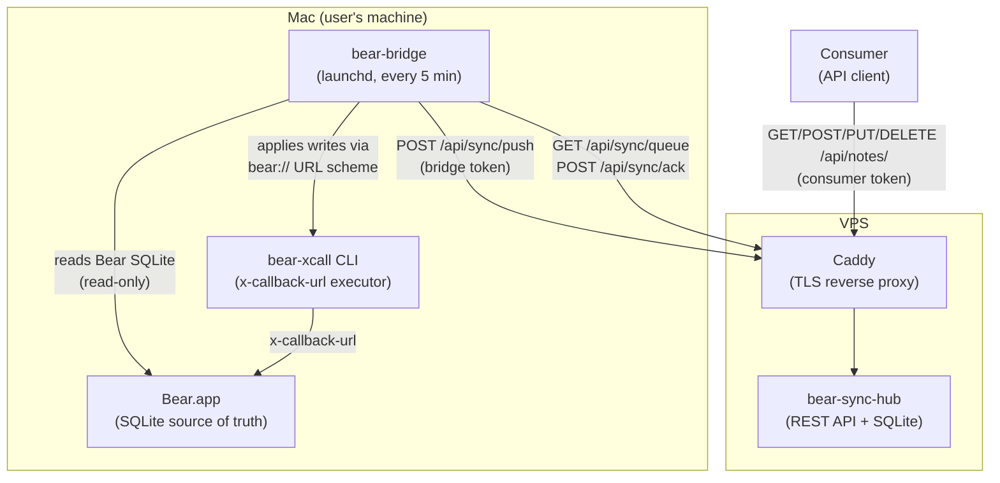
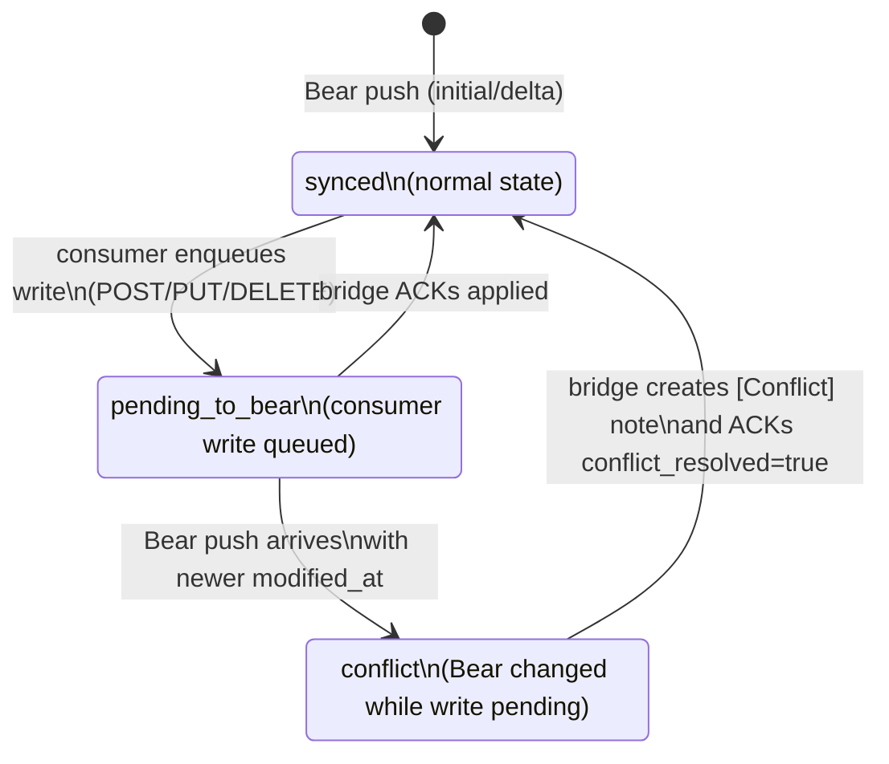

# bear-sync

Syncs Bear notes with external consumers. Two components: **hub** (API server on VPS) and **bridge** (Mac agent that reads Bear SQLite).

## Architecture

### Components

**Bear** — source of truth for all note content. Stores notes in a local SQLite database (Core Data schema). The bridge reads this database directly and applies writes via Bear's x-callback-url scheme.

**Bridge** (`bin/bear-bridge`) — Mac agent that runs on the same machine as Bear. Runs once per invocation (scheduled via launchd). Reads Bear's SQLite, detects changes since the last run, pushes them to the hub, and pulls pending write operations from the hub to apply back to Bear via bear-xcall.

**Hub** (`bin/bear-sync-hub`) — API server that runs on a VPS. Acts as a read replica of Bear's notes and exposes a REST API for external consumers. Holds a write queue for consumer-initiated changes that need to propagate back to Bear.

**Consumers** — external applications that read and write notes via the hub API. Each consumer is identified by name and authenticated with its own token. Multiple consumers can be configured simultaneously. Consumers communicate only with the hub; never touch Bear or the bridge directly.

### System Overview



### Note `sync_status` State Machine

The `sync_status` field on each hub note guards against write conflicts between consumers and Bear.



While a note is `pending_to_bear`, Bear delta pushes do not overwrite `title`/`body` on the hub. If Bear modifies the note before the bridge ACKs, the hub detects a conflict and the bridge creates a `[Conflict] Title` note in Bear instead of overwriting.

### Write Actions

Consumers can enqueue write operations via the hub API. The bridge picks them up and applies them to Bear via x-callback-url.

| Action | Consumer API | Description |
|---|---|---|
| `create` | `POST /api/notes` | Create a new note |
| `update` | `PUT /api/notes/{id}` | Update note title/body |
| `add_tag` | `POST /api/notes/{id}/tags` | Add a tag to a note |
| `trash` | `POST /api/notes/{id}/trash` | Move note to trash |
| `add_file` | `POST /api/notes/{id}/attachments` | Attach a file to a note (multipart, 10 MB limit) |
| `archive` | `POST /api/notes/{id}/archive` | Archive a note |
| `rename_tag` | `PUT /api/tags/{id}` | Rename a tag |
| `delete_tag` | `DELETE /api/tags/{id}` | Delete a tag |

All mutating consumer endpoints require an `Idempotency-Key` header. Encrypted notes are read-only (403).

## Prerequisites

- Go 1.24+
- Xcode Command Line Tools (for building bear-xcall on macOS; provides `swiftc`)
- Bear.app (for bridge)
- bear-xcall CLI (built via `make build-xcall`, for bridge write operations; source in `tools/bear-xcall/`)

## Build

```
make build
```

Binaries are placed in `bin/bear-sync-hub` and `bin/bear-bridge`.

## Hub Setup

### Environment Variables

| Variable | Required | Default | Description |
|---|---|---|---|
| `HUB_HOST` | No | `127.0.0.1` | Listen host (`0.0.0.0` for Docker) |
| `HUB_PORT` | No | `8080` | Listen port |
| `HUB_DB_PATH` | Yes | — | Path to SQLite database file |
| `HUB_CONSUMER_TOKENS` | Yes | — | Consumer tokens in `name:token` format, comma-separated (e.g. `openclaw:secret1,myapp:secret2`) |
| `HUB_BRIDGE_TOKEN` | Yes | — | Bearer token for bridge sync access |
| `HUB_ATTACHMENTS_DIR` | No | `attachments` | Directory for attachment file storage |

### Running

```
export HUB_DB_PATH=/opt/bear-sync/data/hub.db
export HUB_CONSUMER_TOKENS="openclaw:secret1,myapp:secret2"
export HUB_BRIDGE_TOKEN=<token>
./bin/bear-sync-hub
```

The hub listens on `127.0.0.1:PORT` (localhost only). Use a reverse proxy (e.g. Caddy) for TLS termination.

### Systemd (production)

```
sudo cp deploy/bear-sync-hub.service /etc/systemd/system/
sudo systemctl enable bear-sync-hub
sudo systemctl start bear-sync-hub
```

Create `/opt/bear-sync/.env` with the environment variables above.

### Docker Compose (production)

1. Copy `.env.example` to `.env` and fill in secrets:

```
cp .env.example .env
```

2. Set your domain in `.env`:

```
HUB_CONSUMER_TOKENS="openclaw:secret1,myapp:secret2"
HUB_BRIDGE_TOKEN=<token>
DOMAIN=bear-sync.example.com
```

3. Start the stack:

```
docker compose up -d
```

This starts the hub server and Caddy reverse proxy with automatic TLS. The hub is accessible only through Caddy (ports 80/443).

To check status:

```
docker compose ps
curl https://your-domain.com/healthz
```

To update to a new version:

```
docker compose pull
docker compose up -d
```

Data is persisted in Docker named volumes (`hub-data` for SQLite + attachments).

## Bridge Setup

### Environment Variables

| Variable | Required | Default | Description |
|---|---|---|---|
| `BRIDGE_HUB_URL` | Yes | — | Hub API URL (e.g. `https://bear-sync.example.com`) |
| `BRIDGE_HUB_TOKEN` | Yes | — | Bearer token matching `HUB_BRIDGE_TOKEN` |
| `BEAR_TOKEN` | Yes | — | Bear app API token (from Bear preferences) |
| `BRIDGE_STATE_PATH` | No | `~/.bear-bridge-state.json` | Path to bridge state file |
| `BEAR_DB_DIR` | No | `~/Library/Group Containers/9K33E3U3T4.net.shinyfrog.bear/Application Data` | Path to Bear Application Data directory |

### Running

```
export BRIDGE_HUB_URL=https://bear-sync.example.com
export BRIDGE_HUB_TOKEN=<token>
export BEAR_TOKEN=<token>
./bin/bear-bridge
```

The bridge runs once per invocation (no daemon mode). Use launchd to schedule periodic runs.

### Launchd (production)

1. Build and install the binaries:

```
make build
sudo cp bin/bear-bridge /usr/local/bin/
sudo cp -R bin/bear-xcall.app /usr/local/bin/
```

2. Install the launchd plist:

```
cp deploy/com.romancha.bear-bridge.plist ~/Library/LaunchAgents/
```

3. Edit the plist to set your tokens and hub URL:

```
nano ~/Library/LaunchAgents/com.romancha.bear-bridge.plist
```

4. Load the agent:

```
launchctl load ~/Library/LaunchAgents/com.romancha.bear-bridge.plist
```

The bridge runs every 5 minutes. bear-xcall.app must be in the same directory as the bear-bridge binary.

## Reverse Proxy

A sample Caddyfile is provided in `deploy/Caddyfile` for systemd setup. For Docker Compose, `deploy/Caddyfile.docker` is used automatically.

The sample Caddyfile uses rate limiting, which requires the [caddy-ratelimit](https://github.com/mholt/caddy-ratelimit) plugin. Build Caddy with this plugin using `xcaddy`:

```
xcaddy build --with github.com/mholt/caddy-ratelimit
```

## Development

```
make test          # run all tests
make test-race     # run tests with race detector
make test-xcall    # run bear-xcall manual tests (macOS + Bear)
make build-xcall   # build bear-xcall .app bundle (macOS only)
make lint          # run golangci-lint
make fmt           # format code
make tidy          # go mod tidy
```

## CI/CD

GitHub Actions runs automatically:

- **CI** (push/PR to main): lint, test, test with race detector
- **Docker Publish** (push tag `v*`): builds multi-platform image (`linux/amd64`, `linux/arm64`) and pushes to `ghcr.io/romancha/bear-sync-hub`

To publish a new release:

```
git tag v0.1.0
git push origin v0.1.0
```
