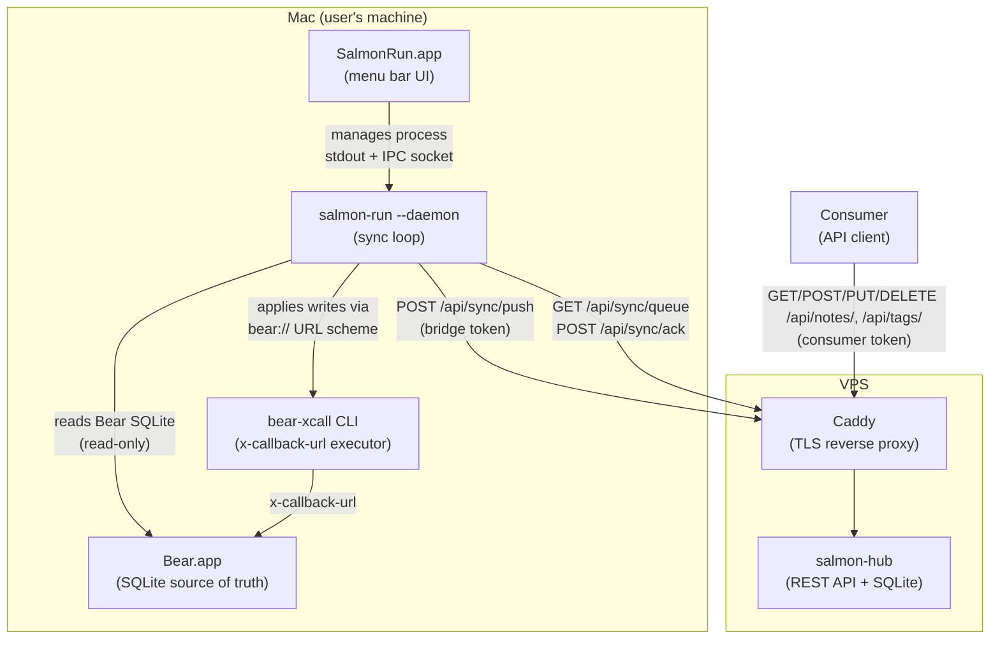
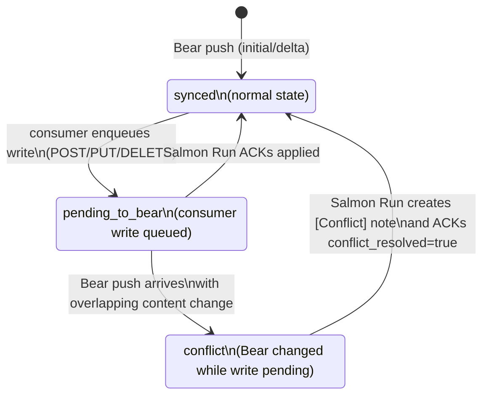

# Salmon

Syncs Bear notes with external consumers. Two components: **hub** (API server on VPS) and **salmon-run** (Mac agent that reads Bear SQLite).

## Why Salmon?

Bear catches salmon — Bear.app is the source of truth for notes, and Salmon is the data that flows through the system. The salmon run (upstream migration) represents data flowing from Bear to the hub. The hub serves data downstream to consumers like a salmon stream. The bidirectional flow of data — notes flowing upstream from Bear to consumers, and write operations flowing back downstream to Bear — mirrors the salmon lifecycle.

## Architecture

### Components

**Bear** — source of truth for all note content. Stores notes in a local SQLite database (Core Data schema). Salmon Run reads this database directly and applies writes via Bear's x-callback-url scheme.

**Salmon Run** (`bin/salmon-run`) — Mac agent that runs on the same machine as Bear. Runs in daemon mode (`--daemon`) with a continuous sync loop, managed by SalmonRun.app. Reads Bear's SQLite, detects changes since the last run, pushes them to the hub, and pulls pending write operations from the hub to apply back to Bear via bear-xcall.

**SalmonRun.app** — native macOS menu bar application that wraps the salmon-run binary. Provides a GUI for monitoring sync status, viewing logs, triggering manual syncs, and configuring settings. The salmon-run process runs as a managed child process in daemon mode.

**Hub** (`bin/salmon-hub`) — API server that runs on a VPS. Acts as a read replica of Bear's notes and exposes a REST API for external consumers. Holds a write queue for consumer-initiated changes that need to propagate back to Bear.

**Consumers** — external applications that read and write notes via the hub API. Each consumer is identified by name and authenticated with its own token. Multiple consumers can be configured simultaneously. Consumers communicate only with the hub; never touch Bear or Salmon Run directly.

### System Overview



### Note `sync_status` State Machine

The `sync_status` field on each hub note guards against write conflicts between consumers and Bear.



While a note is `pending_to_bear`, Bear delta pushes do not overwrite `title`/`body` on the hub. Conflict detection is field-level: the hub snapshots Bear's title/body when transitioning to `pending_to_bear`, and a conflict is raised only if Bear changed a content field (title or body) that the consumer also changed. Metadata-only changes (e.g., opening the note in Bear) do not trigger a conflict. On conflict, Salmon Run creates a `[Conflict] Title` note in Bear instead of applying the queued write.

### Write Actions

Consumers can enqueue write operations via the hub API. Salmon Run picks them up and applies them to Bear via x-callback-url.

| Action | Consumer API | Description |
|---|---|---|
| `create` | `POST /api/notes` | Create a new note |
| `update` | `PUT /api/notes/{id}` | Update note title/body |
| `add_tag` | `POST /api/notes/{id}/tags` | Add a tag to a note |
| `trash` | `DELETE /api/notes/{id}` | Move note to trash |
| `add_file` | `POST /api/notes/{id}/attachments` | Attach a file to a note (multipart, 5 MB limit) |
| `archive` | `POST /api/notes/{id}/archive` | Archive a note |
| `rename_tag` | `PUT /api/tags/{id}` | Rename a tag |
| `delete_tag` | `DELETE /api/tags/{id}` | Delete a tag |

All mutating consumer endpoints require an `Idempotency-Key` header. Encrypted notes are read-only (403).

## Prerequisites

- Go 1.26+
- Xcode Command Line Tools (for building bear-xcall and SalmonRun.app on macOS; provides `swiftc`)
- Bear.app (for salmon-run)
- bear-xcall CLI (built via `make build-xcall`, for salmon-run write operations; source in `tools/bear-xcall/`)

## Build

```
make build
```

Binaries are placed in `bin/salmon-hub`, `bin/salmon-run`, `bin/salmon-mcp`, `bin/bear-xcall.app`, and `bin/SalmonRun.app` (macOS only).

## Hub Setup

### Environment Variables

| Variable | Required | Default | Description |
|---|---|---|---|
| `SALMON_HUB_HOST` | No | `127.0.0.1` | Listen host (`0.0.0.0` for Docker) |
| `SALMON_HUB_PORT` | No | `7433` | Listen port |
| `SALMON_HUB_DB_PATH` | Yes | — | Path to SQLite database file |
| `SALMON_HUB_CONSUMER_TOKENS` | Yes | — | Consumer tokens in `name:token` format, comma-separated (e.g. `openclaw:secret1,myapp:secret2`) |
| `SALMON_HUB_BRIDGE_TOKEN` | Yes | — | Bearer token for Salmon Run sync access |
| `SALMON_HUB_ATTACHMENTS_DIR` | No | `attachments` | Directory for attachment file storage |

### Running

```
export SALMON_HUB_DB_PATH=/opt/salmon/data/hub.db
export SALMON_HUB_CONSUMER_TOKENS="openclaw:secret1,myapp:secret2"
export SALMON_HUB_BRIDGE_TOKEN=<token>
./bin/salmon-hub
```

The hub listens on `127.0.0.1:PORT` (localhost only). Use a reverse proxy (e.g. Caddy) for TLS termination.

### Systemd (production)

```
sudo cp deploy/salmon-hub.service /etc/systemd/system/
sudo systemctl enable salmon-hub
sudo systemctl start salmon-hub
```

Create `/opt/salmon/.env` with the environment variables above.

### Docker Compose (production)

1. Create a `.env` file with your secrets:

```
SALMON_HUB_CONSUMER_TOKENS="openclaw:secret1,myapp:secret2"
SALMON_HUB_BRIDGE_TOKEN=<token>
DOMAIN=salmon.example.com
```

2. Start the stack:

```
docker compose up -d
```

This starts the hub server and Caddy reverse proxy with automatic TLS. The hub is accessible only through Caddy (ports 80/443).

To check status:

```
docker compose ps
curl https://your-domain.com/healthz
```

To update to a new version:

```
docker compose pull
docker compose up -d
```

Data is persisted in Docker named volumes (`hub-data` for SQLite + attachments).

#### Volume Permissions (Synology / bind mounts)

The hub container runs as non-root user `hub` (UID 1000). When using bind mounts, ensure the host directory is owned by UID 1000, otherwise SQLite will fail with `unable to open database file: out of memory (14)`:

```
mkdir -p /volume1/docker/salmon_hub/attachments
chown -R 1000:1000 /volume1/docker/salmon_hub
```

This is not needed for Docker named volumes — they inherit permissions from the image automatically.

## Salmon Run Setup

### Environment Variables

| Variable | Required | Default | Description |
|---|---|---|---|
| `SALMON_HUB_URL` | Yes | — | Hub API URL (e.g. `https://salmon.example.com`) |
| `SALMON_HUB_TOKEN` | Yes | — | Bearer token matching `SALMON_HUB_BRIDGE_TOKEN` |
| `SALMON_BEAR_TOKEN` | Yes | — | Token for Bear x-callback-url API (any string, e.g. `openssl rand -base64 32`; Bear will prompt to allow access on first use) |
| `SALMON_STATE_PATH` | No | `~/.salmon-state.json` | Path to salmon-run state file |
| `SALMON_BEAR_DB_DIR` | No | `~/Library/Group Containers/9K33E3U3T4.net.shinyfrog.bear/Application Data` | Path to Bear Application Data directory |
| `SALMON_SYNC_INTERVAL` | No | `300` | Sync interval in seconds (daemon mode only) |
| `SALMON_IPC_SOCKET` | No | `~/.salmon.sock` | Unix socket path for IPC (daemon mode only) |

### Running

```
export SALMON_HUB_URL=https://salmon.example.com
export SALMON_HUB_TOKEN=<token>
export SALMON_BEAR_TOKEN=<token>
./bin/salmon-run
```

CLI flags:
- `--daemon` — run continuously with periodic sync (default interval: 5 minutes)
- `--version` — print version and exit

The recommended way to run salmon-run is via the [Menu Bar App](#menu-bar-app-salmonrunapp), which manages it in daemon mode with a GUI.

## Menu Bar App (SalmonRun.app)

SalmonRun.app is a native macOS menu bar application (macOS 14+) that manages salmon-run as a child process in daemon mode and provides a GUI for monitoring and configuration.

### Menu Bar UI

The app lives in the macOS menu bar with a sync icon that changes color based on status:

```
┌─────────────────────────┐
│ ● Synced                │  ← green (idle), yellow (syncing), red (error)
│ Last sync: 2 min ago    │
│ ─────────────────────── │
│ ▸ Sync Now              │  ← triggers immediate sync
│ ─────────────────────── │
│ Notes: 1,234            │
│ Tags: 56                │
│ Queue: 0 pending        │
│ ─────────────────────── │
│ ▸ View Logs...          │  ← opens log viewer window
│ ▸ Settings...           │  ← opens settings window
│ ─────────────────────── │
│ ▸ Quit Salmon Run       │
└─────────────────────────┘
```

### Features

- Menu bar icon with color-coded sync status (green/yellow/red)
- One-click "Sync Now" to trigger immediate sync
- Live statistics: notes, tags, and write queue counts
- Log viewer window with search, level filtering, and auto-scroll
- Settings window with Hub URL, tokens (Keychain-secured), sync interval, and Launch at Login
- macOS notifications on sync errors (rate-limited, configurable)
- Auto-restart of salmon-run process on unexpected exit (up to 3 retries)

### Settings

Settings are accessible from the menu bar popup via "Settings...":

| Tab | Setting | Storage | Description |
|---|---|---|---|
| Connection | Hub URL | UserDefaults | URL of your Salmon hub server |
| Connection | Hub Token | Keychain | Salmon Run authentication token (matches `SALMON_HUB_BRIDGE_TOKEN`) |
| Connection | Bear Token | Keychain | Token for Bear x-callback-url API |
| Sync | Sync interval | UserDefaults | How often to sync (1-30 minutes, default 5) |
| Sync | Sync on launch | Always on | Automatically syncs when the app starts |
| General | Launch at Login | SMAppService | Auto-start SalmonRun.app on login |
| General | Notifications | UserDefaults | Show macOS notifications on sync errors |

Tokens are stored securely in the macOS Keychain. All other settings use UserDefaults. The app generates environment variables for the salmon-run process from these settings.

### Install

Download the .dmg for your architecture from the [Releases](../../releases) page:

- `SalmonRun-vX.Y.Z-arm64.dmg` (Apple Silicon)
- `SalmonRun-vX.Y.Z-amd64.dmg` (Intel)

Open the .dmg and drag SalmonRun.app to `/Applications`. Launch from Applications and configure your Hub URL and tokens in Settings.

From source:

```
make build-app
cp -R bin/SalmonRun.app /Applications/
```

### Build

```
make build-app       # Build SalmonRun.app (includes salmon-run + bear-xcall)
make test-app        # Run Swift tests
```

## Reverse Proxy

A sample Caddyfile is provided in `deploy/Caddyfile` for systemd setup. For Docker Compose, `deploy/Caddyfile.docker` is used automatically.

The sample Caddyfile uses rate limiting, which requires the [caddy-ratelimit](https://github.com/mholt/caddy-ratelimit) plugin. Build Caddy with this plugin using `xcaddy`:

```
xcaddy build --with github.com/mholt/caddy-ratelimit
```

## API Documentation

The hub serves interactive API documentation via Swagger UI at `/api/docs/` (requires consumer auth).

To regenerate the OpenAPI spec after changing handler annotations:

```
make swagger
```

For a quick start guide with curl examples and integration details, see [docs/consumer-api.md](docs/consumer-api.md).

## MCP Server

The MCP (Model Context Protocol) server allows AI assistants like Claude Code, Cursor, and OpenClaw to interact with Bear notes natively — without shell commands or manual API calls.

The server exposes all 13 consumer API operations as MCP tools over stdio transport.

### Build

```
make build-mcp
```

Or build everything (includes MCP server):

```
make build
```

### Environment Variables

| Variable | Required | Description |
|---|---|---|
| `SALMON_HUB_URL` | Yes | Hub API URL (e.g. `https://salmon.example.com`) |
| `SALMON_CONSUMER_TOKEN` | Yes | Consumer Bearer token |

### Claude Code

Add to `.claude/mcp.json`:

```json
{
  "mcpServers": {
    "salmon": {
      "command": "/path/to/salmon-mcp",
      "env": {
        "SALMON_HUB_URL": "https://salmon.example.com",
        "SALMON_CONSUMER_TOKEN": "your-token"
      }
    }
  }
}
```

### OpenClaw

Add to your `openclaw.json` (or use the [OpenClaw skill](tools/consumer/openclaw/bear-salmon-notes/) for a curl-based alternative):

```json
{
  "mcpServers": {
    "salmon": {
      "command": "/path/to/salmon-mcp",
      "env": {
        "SALMON_HUB_URL": "https://salmon.example.com",
        "SALMON_CONSUMER_TOKEN": "your-token"
      }
    }
  }
}
```

### Available Tools

| Tool | Description |
|---|---|
| `search_notes` | Full-text search across notes |
| `get_note` | Get a note by ID (includes tags, attachments, backlinks) |
| `list_notes` | List notes with optional filters |
| `list_tags` | List all tags |
| `get_attachment` | Get attachment content (base64) |
| `sync_status` | Get sync status metadata |
| `list_backlinks` | List backlinks for a note |
| `create_note` | Create a new note |
| `update_note` | Update note title/body |
| `trash_note` | Move a note to trash |
| `archive_note` | Archive a note |
| `add_tag` | Add a tag to a note |
| `rename_tag` | Rename a tag |
| `delete_tag` | Delete a tag |

## Development

```
make test          # run all tests
make test-race     # run tests with race detector
make test-xcall    # run bear-xcall manual tests (macOS + Bear)
make test-app      # run SalmonRun Swift tests (macOS only)
make build-mcp     # build salmon-mcp binary
make build-xcall   # build bear-xcall .app bundle (macOS only)
make build-app     # build SalmonRun.app menu bar app (macOS only)
make lint          # run golangci-lint
make fmt           # format code
make tidy          # go mod tidy
make swagger       # generate Swagger docs (swag init)
```

## CI/CD

GitHub Actions runs automatically:

- **CI** (push/PR to main): lint, test, test with race detector
- **Docker Publish** (push tag `v*`): builds multi-platform hub image (`linux/amd64`, `linux/arm64`) and pushes to `ghcr.io/romancha/salmon-hub`
- **Release** (push tag `v*`): builds, signs, notarizes, and publishes SalmonRun.app as .dmg for macOS (`arm64`, `amd64`) as GitHub Release assets

### Publishing a release

Tag and push to trigger both Docker and release workflows:

```
git tag v0.1.0
git push origin v0.1.0
```

Pre-release tags (e.g., `v0.1.0-rc.1`) are automatically marked as pre-releases on GitHub.

### Required GitHub secrets for release

The release workflow requires Apple code signing credentials. Set these in the repository settings under Settings > Secrets and variables > Actions:

| Secret | Description |
|---|---|
| `APPLE_CERTIFICATE` | Base64-encoded Developer ID Application .p12 certificate (`base64 -i cert.p12 \| pbcopy`) |
| `APPLE_CERTIFICATE_PASSWORD` | Password for the .p12 certificate |
| `APPLE_TEAM_ID` | Apple Developer Team ID |
| `APPLE_ID` | Apple ID email for notarytool authentication |
| `APPLE_ID_PASSWORD` | App-specific password for notarytool (generate at [appleid.apple.com](https://appleid.apple.com/account/manage)) |

Setup steps:
1. Export your Developer ID Application certificate as .p12 from Keychain Access
2. Base64-encode it: `base64 -i cert.p12 | pbcopy`
3. Create an app-specific password at https://appleid.apple.com/account/manage
4. Add all five secrets in the repository settings
